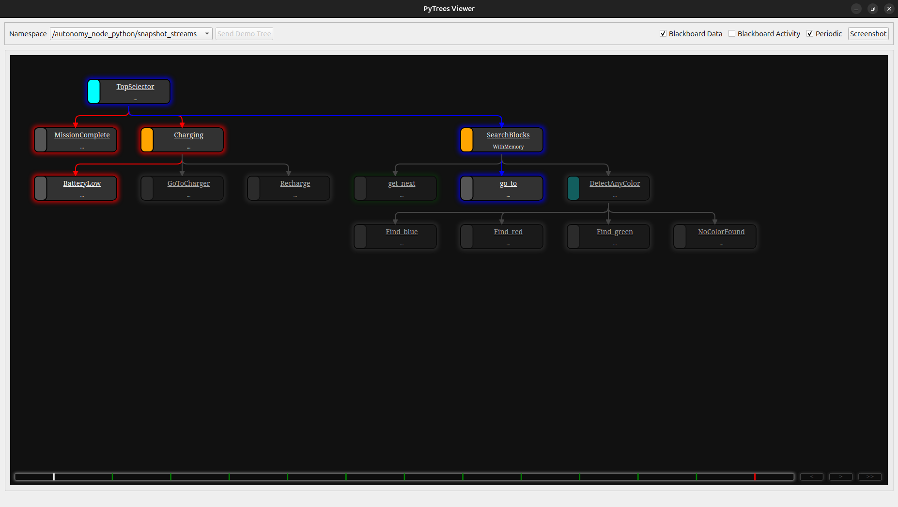
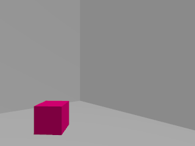
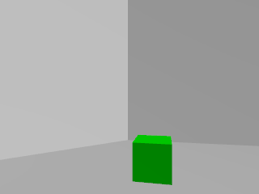

# Behaviour Tree Simulation using TurtleBot3

This project demonstrates how Behaviour Trees can control a TurtleBot3 robot in a ROS2 + Gazebo simulation.  
The robot visits predefined locations, detects coloured blocks (red, green, blue), monitors battery level, returns to a charger when low, then resumes the mission.  
Once all blocks are found, the behaviour tree ends with **Mission Complete**.

---

## System Requirements

| Component | Version Used |
|-----------|--------------|
| Operating System | **Ubuntu 24.04** |
| ROS2 | **Jazzy** |
| Gazebo | **Harmonic** |
| TurtleBot3 Packages | `turtlebot3`, `turtlebot3_simulations` |
| Behaviour Tree Library | **py-trees** |
| Vision | OpenCV + cv_bridge |
| Simulation Tools | Nav2, SLAM, Gazebo plugins |

---

##  Dependencies & Required Packages

Install ROS2 dependencies:

```bash
sudo apt update
sudo apt install ros-jazzy-nav2-bringup \
                 ros-jazzy-turtlebot3* \
                 ros-jazzy-cv-bridge \
                 ros-jazzy-image-transport \
                 ros-jazzy-gazebo-ros-pkgs \
                 ros-jazzy-rmw-cyclonedds-cpp
```
Install Python libraries:

```bash
pip install py-trees
pip install opencv-python
```

Set TurtleBot3 model:

```bash
echo "export TURTLEBOT3_MODEL=burger" >> ~/.bashrc
source ~/.bashrc
```

##Workspace Setup

Create workspace (only if not already created):

```bash
mkdir -p ~/tb3_bt_ws/src
cd ~/tb3_bt_ws/src
```

Clone TurtleBot3 simulation (if needed):

```bash
git clone https://github.com/ROBOTIS-GIT/turtlebot3_simulations.git
```

Clone this Behaviour Tree project:

```bash
git clone https://github.com/<your-username>/Behaviour-Tree-using-TurtleBot3.git
```

Build:

```bash
cd ~/tb3_bt_ws
colcon build
source install/setup.bash
```


## Running the Simulation

1. Start Gazebo with the house world

(Example command – your world may differ)

```bash
ros2 launch turtlebot3_gazebo turtlebot3_house.launch.py
```

2. Launch Navigation Stack

```bash
ros2 launch turtlebot3_navigation2 navigation2.launch.py use_sim_time:=true
```

3. Run Behaviour Tree Autonomy Node

```bash
cd ~/tb3_bt_ws
source install/setup.bash
ros2 launch tb_autonomy tb_demo_behavior_py.launch.py
```

You should now see:

Robot moving between rooms

Battery percentage logging in terminal

Charging behaviour when low

Block detections saved in bt_images/


## Behaviour Tree Design

This project uses py-trees with the following structure:

- Root
  - Sequence
     1. Go to next location
     2. Scan for coloured blocks
     3. Save detection screenshot
     4. Reduce battery and move forward
     5. Repeat until all blocks are found

If battery goes below threshold, a Fallback node takes control:

  - Navigate to charger
    
  - Wait 5 seconds for recharge
    
  - Continue mission
    
When all three colours are detected:

  - Robot stops and prints **Mission Complete**


## Output and Logs

✔ Terminal prints battery level and detected colours

✔ Images saved in ~/bt_images

✔ Behaviour Tree can be visualized:

```bash
py-trees-tree-viewer
```

### Behaviour Tree Viewer




### Images detected by Turtlebot

 


### Demo World in Gazebo


### Live data and feedback from termimnal


## Purpose

This setup demonstrates:

- Behaviour Trees in a real robot navigation task

- Modularity (navigation, vision, battery management separated)

- Recovery behaviour using fallback trees

- State-based autonomy without a long “if/else” control script


This fulfills the assignment:

**“Demonstrate the use of Behaviour Trees in a simulated environment.”**


## Author

**Rohith Santhosh**

**B.Tech Robotics & Automation**

**Saintgits College of Engineering**


